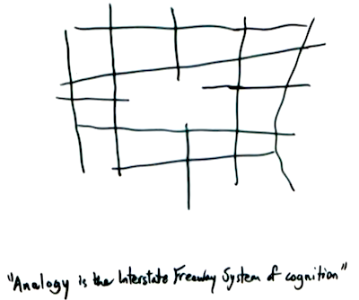

# Daydreamer: 

### Under (heavy) construction

For use in Python 3.6. An extension of [World Models](https://arxiv.org/pdf/1803.10122.pdf) (Ha, Schmidhuber 2018) wherein
agents learn to generate mappings (or more poetically, create analogies) between environments to learn the general
structure underlying similar tasks. Using the OpenAI Gym, the Atari games Montezuma's Revenge and Frostbite are simulated
consecutively for E iterations, with the frames seen at a given time step in the previous simulation acting as the target for the agents' 
generative model at the same timestep in the current simulation. Where no prior "memory" exists, the generative model produces
its best guess for what the corresponding frame "should" be.

An untrained Mixture Density RNN (built in tensorflow) is used as a reservoir to supply the generative model with temporal information.

At this rudimentary stage, the system is being forced to "dream" in B while navigating A, but future versions will seek to  
to generate unforced mappings. Analogous (!) to how when someone comments on the quality of a slice of cake, humans create 
an unforced mapping (or analogy) to the rest of the cake, despite them being nominally distinct objects. Or how we unconsciously extract 
lessons from literature or film by analogizing what we see or read to aspects of our own life. See [Hofstadter](https://www.amazon.com/Am-Strange-Loop-Douglas-Hofstadter/dp/0465030793) for a more philosophical treatment.

An additional change is that Q-Learning has replaced CMA-ES for reasons that will become clear in future versions.

The variational autoencoder (also built in TensorFlow) is, in theory, equipped to handle convolutional encodings, but is currently built for simple feedforward
network architectures. 

Much more yet to come.

